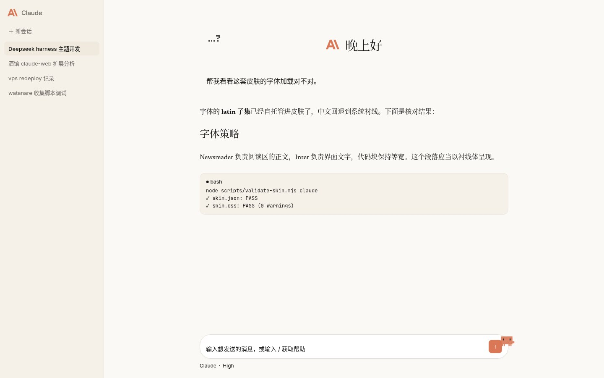
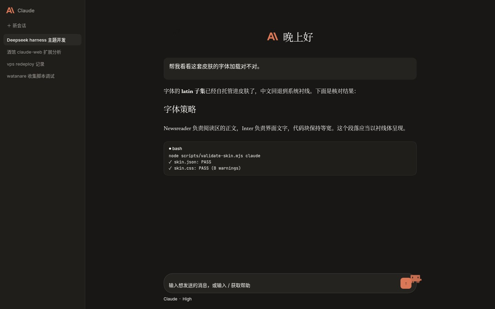

# Claude — a DSH Web GUI theme

> **If Anthropic considers this an infringement, contact me and I will take it down.**

Rebuilds the DSH Web GUI in the visual language of the claude.ai app: warm cream canvas, serif reading text, coral accent.

This repo ships **three artifacts**. Two of them are plugins that are **fully
independent of the skin** and can be installed on their own:

| Artifact | Path | Needs the skin center? | Install |
| --- | --- | --- | --- |
| Skin | `claude/` | **Yes** | Copy to `$DSH_HOME/skins/claude/`, select it in Settings |
| Claude plugin | `brand-plugin/` | **No** | `dsh plugin --profile web add link:<abs path>` + restart |
| Clawd plugin | `crab-plugin/` | **No** | `dsh plugin --profile web add link:<abs path>` + restart |

### How they depend on each other

**The skin is a pure asset directory** with no executable code. It is read and
rendered by the third-party skin center (`@linxin666/dsh-client-ui-skin-center`)
and **must** go through it — that is the only entry point for a skin.

**Neither plugin goes through the skin center.** They are ordinary Cordis client
plugins loaded by DSH's own plugin system, and they depend only on official
things:

| Plugin | Cordis service | CSS variables |
| --- | --- | --- |
| `brand-plugin` | `slots` | `--dsw-*` (from the official theme service) |
| `crab-plugin` | `timer` | `--dsw-*` plus its own `--dcc-*` |

**The key point:** neither plugin references a single skin variable (skin
variables use the `--cl-*` prefix; the reference count is zero). The Clawd plugin
embeds its own pixel frame data instead of reading it from the skin.

So the plugins can be installed without the skin — the crab and the rebranding
work fine, they simply take their colours from whatever theme is active.
Installing the skin without the plugins works too; it ships its own small pixel
sparkle beside the greeting.

**Why rebranding is not part of the skin:** a locally authored skin cannot run
`hooks.mjs` (the loader only admits official-market origins — see
[Limitations](#limitations)), and swapping the brand mark means replacing slot
occupants, which only a plugin can do.

**Status:** all three artifacts are verified working on this machine — the skin validates with zero warnings, and both plugins are linked into the web profile and confirmed through the real page DOM (sidebar shows the Claude starburst SVG and the text wordmark; an interactive Clawd sits on the composer edge).

---

## Preview

```markdown


```


Screenshots of the real running UI at 1440×900. Sampled to verify: the light canvas is `rgb(250,249,245)` = `#faf9f5` and the dark canvas is `rgb(24,23,21)` = `#181715`, both exact design values.

---

## Features

- **Warm cream canvas** — `#faf9f5` replaces the stock cool gray-white; elevation steps down through `#f5f0e8` / `#efe9de` / `#e8e0d2`.
- **All 278 `--dsw-*` tokens declared explicitly**, covering both light and dark (97 alias tokens carry the same name with different values per mode). Nothing is left to the loader's token auto-derivation (see [Limitations](#limitations)).
- **Newsreader serif body** — markdown prose, headings and quotes use the serif; UI chrome (buttons, menus, labels) uses Inter; code uses JetBrains Mono.
- **Warm-black dark mode** — `#181715`, never pure black.
- **Fonts vendored** — 4 woff2 files, 364 KB total, self-hosted inside the skin directory. No external requests.
- **Radius ladder and pill composer** — `patches.css` reworks radii, the composer, cards and scrollbars via L3 free selectors.
- **Third-party plugin blending** — non-official plugin chrome is neutralized to follow Claude's card language instead of its own palette.
- **Live switching** — the skin center swaps atomically in the page. No reload, no restart.

---

## Layout

```
dsh-claude-theme/
├── claude/                          # the skin (pure assets)
│   ├── skin.json                    # manifest v2: id=claude, accent=#d97757, contributes
│   ├── skin.css                     # 278 --dsw-* tokens (light + dark) + @font-face
│   ├── patches.css                  # L3 free-selector patches
│   ├── assets/fonts/                # self-hosted fonts (latin subsets, 364 KB total)
│   │   ├── newsreader-normal.woff2  #   variable 200–800
│   │   ├── newsreader-italic.woff2  #   variable 200–800
│   │   ├── inter-normal.woff2       #   variable 100–900
│   │   ├── jetbrains-mono-normal.woff2  # variable 100–800
│   │   ├── fonts.generated.css      # build-fonts.sh output, inlined by gen-skin-css.py
│   │   └── build-fonts.sh           # re-downloads the woff2 files
│   └── preview/                     # preview images (1440x900, light + dark)
│       ├── light.jpg                #   1440×900
│       └── dark.jpg                 #   1440×900
├── brand-plugin/                    # Claude plugin, dsh-claude-brand
│   ├── package.json                 #   declares dsh.bundle.patch and dsh.client.platform=web
│   ├── cordis.patch.yml             #   inserts the dsh-claude-brand row into the web roster
│   └── lib/
│       ├── index.js                 #   host half: deliberately empty (no host state, no RPC)
│       └── client.js                #   browser half: slot registration + text rewriting
├── scripts/
│   ├── gen-skin-css.py              # regenerate claude/skin.css from the palette
│   ├── validate-skin.mjs            # validate the skin with the real skin-center sanitizer
│   └── capture-preview.sh           # screenshot the GUI for previews (not working yet; see scripts/README.md)
├── README.md                        # Chinese
├── README.en.md                     # this file
├── INSTALL.md                       # step-by-step install and troubleshooting
├── LICENSE                          # MIT (code/CSS) + font and trademark notices
└── .gitignore
```

Script usage is documented in [`scripts/README.md`](scripts/README.md).

---

## Install

Requires the skin-center plugin `@linxin666/dsh-client-ui-skin-center` (this skin was tested against **v0.3.23**).

### 1. The skin

Copy the whole `claude/` directory into `$DSH_HOME/skins/`, keeping the directory name `claude`:

```bash
# DSH_HOME defaults to ~/.dsh
cp -r claude "$HOME/.dsh/skins/claude"
```

Then open **Settings → Skin Center** in the GUI and pick **Claude**. The switch is live; no restart.

Verify it was discovered:

```bash
curl -s http://127.0.0.1:3080/api/skin-center/v2/catalog \
  | python3 -c "import json,sys; print([ (s['manifest']['id'], s.get('warnings')) for s in json.load(sys.stdin)['skins'] if s['manifest']['id']=='claude' ])"
```

Expected: `[('claude', [])]` — note the empty `warnings`.

### 2. The Claude plugin

> Verified working on a real page. Not yet installed on a clean machine.

```bash
dsh plugin --profile web add link:/path/to/dsh-claude-theme/brand-plugin
# then restart DSH once (client plugins load at startup; they cannot hot-swap)
```

Package name: `dsh-claude-brand`. The plugin does four things:

1. Registers at priority **-10** on the `sidebar.brand.mark` and `conversation.hero.brand.mark` slots to shadow the official whale logo, replacing it with an inline SVG of the Anthropic/Claude radial starburst mark (`currentColor`, so it follows the theme).
2. Replaces the official glyph-outline wordmark on `sidebar.brand.name` with real text reading "Claude".
3. Swaps the hero headline ("探索未至之境" / "Into the Unknown") for a time-of-day greeting, and rewrites the product name in the document title.
4. Hangs every side effect on `ctx.effect` so disabling the plugin restores the originals.

On priority: slot shadowing renders the **lowest number first**, so -10 outranks the official brand plugin at 0; registering at the same priority on a `single` slot throws.

Full install and troubleshooting steps: [`INSTALL.md`](INSTALL.md).

---

## Limitations

- **Locally-authored skins cannot run `hooks.mjs`.** The loader refuses outright for any skin without official-market provenance, returning HTTP 403 `hooks-require-review`. That is why branding is a separate plugin rather than a skin hook.
- **Remote fonts are hard-rejected.** `@import`, remote/protocol-relative URLs, absolute paths and `../` escapes are all rejected by the sanitizer (422). Fonts must live inside the skin directory and be referenced relatively.
- **Tool-call cards are not a 1:1 reproduction.** claude.ai has no equivalent component; tool cards are DSH-specific UI. They are restyled in Claude's card language (hairline borders, restrained radii, warm layers) — stylistic alignment, not a replica.
- **The preview images are screenshots of the real running UI.**
- **The Claude plugin is verified on a real page** (sidebar mark is the Claude starburst SVG, name reads "Claude"), but has not been installed on a clean machine.
- **No reliance on token auto-derivation.** The loader's fallback derivation is effectively non-functional — across roughly 190 uncovered tokens it derives about 1, leaving the rest at stock values. All 278 tokens here are declared explicitly.
- **Force-scoped.** All CSS is prefixed by the loader under `html[data-dsh-skin="claude"]`, so the skin only affects the page while selected and cannot leak into other skins.

---

## License and notices

- Code and CSS: MIT, see [`LICENSE`](LICENSE).
- Vendored fonts: Newsreader, Inter and JetBrains Mono are licensed under the SIL Open Font License 1.1 and are included in `claude/assets/fonts/`.
- Trademarks: this is an **unofficial fan tribute**. "Claude" and "Anthropic" are trademarks of Anthropic PBC. This project is not affiliated with or endorsed by Anthropic.
- **Copernicus and StyreneB are not included.** Those are Anthropic's actual typefaces and are licensed fonts that cannot be redistributed. This project substitutes the open Newsreader (for Copernicus's serif role) and Inter (for StyreneB's sans role) — similar in spirit, not identical.

---

## Credits

- The skin-center plugin [`@linxin666/dsh-client-ui-skin-center`](https://github.com/zhu1090093659/dsh-web), which provides skin loading, manifest validation, CSS sanitization and live switching.
- The type designers behind Newsreader, Inter and JetBrains Mono, and Google Fonts' latin subset builds.
- The SillyTavern extension [claude-web](https://github.com/claudenoshujin/claude-web) by **lulu**: source of the Clawd pixel geometry, and a key reference for the palette.
- Anthropic's claude.ai interface, whose look this project reproduces.
