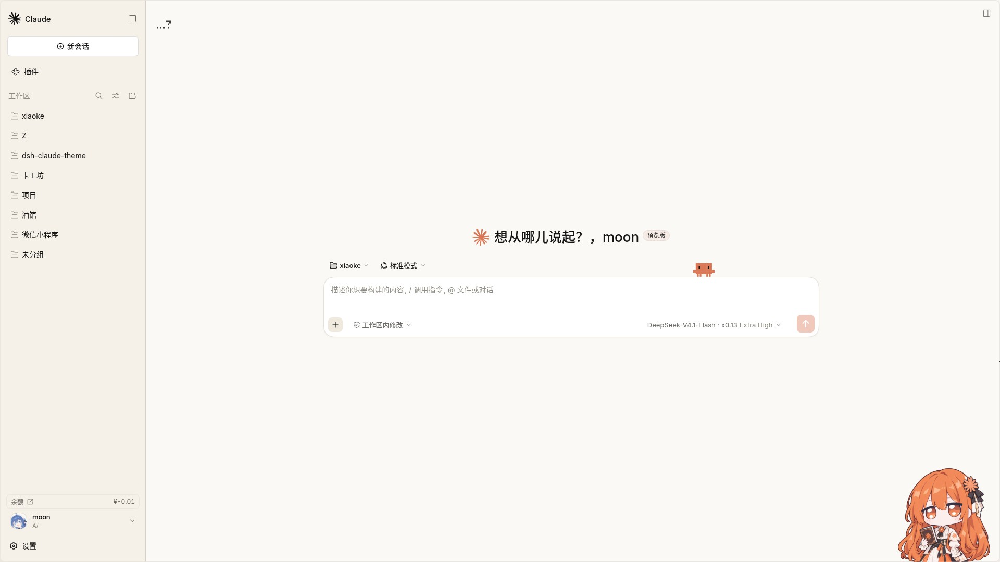
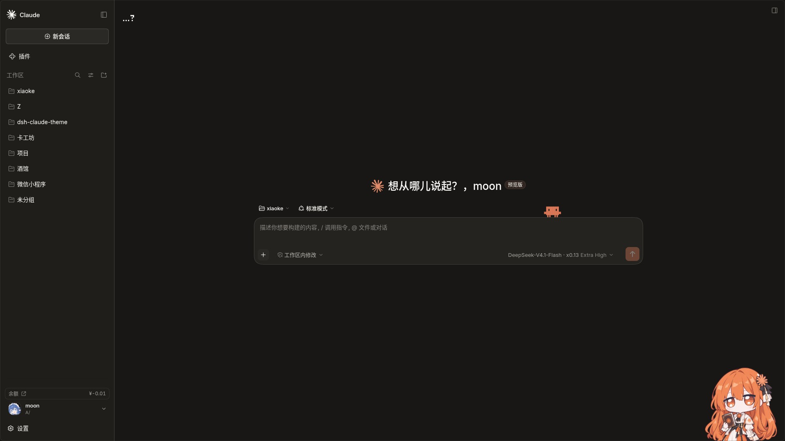

|  |  |
| --- | --- |

> ~~**我看鲸小妹和克小妹也是一对苦命鸳鸯啊。**~~

# Claude — DSH Web GUI 主题

> ~~**Anthropic 觉得侵权可以联系我下架。**~~

把 DSH Web GUI 换成 claude.ai 的样子：暖米色画布、衬线正文、珊瑚色强调。

仓库里有五样东西，各装各的，互不影响：

| | 是什么 |
| --- | --- |
| **皮肤** `claude/` | 配色、字体、圆角。就是皮肤本体 |
| **皮肤插件** `plugins/skin/` | 装载皮肤：不装皮肤中心也能用皮肤，并自动把皮肤装到位 |
| **Claude 插件** `brand-plugin/` | 品牌替换：侧栏的星芒标记和字标、首页问候语、浏览器标题和图标 |
| **Clawd 插件** `crab-plugin/` | 宠物：输入框上沿那只可以戳的像素蟹 |
| **字体切换插件** `plugins/font-switcher/` | 小工具：换掉皮肤用的三组字体 |

### 皮肤有两种装法

**一、走皮肤中心。** 你要是本来就在用 `@linxin666/dsh-client-ui-skin-center`，直接在它的市场里搜 Claude 装上就行，不用手动拷贝。装完在设置里选中。

**二、走独立插件。** 不想为了一个皮肤装一整套皮肤中心，就装 `plugins/skin/`。它**会自己把皮肤装好**——首次加载时把仓库里的 `claude/` 拷进 `$DSH_HOME/skins/claude`，重启后在 **设置 → Claude-X** 里选中即可，没有手动拷贝这一步。它只干皮肤该干的事——读目录、把样式送进页面、把字体和图片递出去，不带背景图、市场、壁纸那些。

两种**别一起装**，会各送一遍同样的样式。

### 它们之间

四个插件各管各的：设置页不共用（皮肤在 **Claude-X**、蟹在 **Clawd**、字体在 **字体**），数据也各存各的。只有两个小约定：

- 名字、副标题、头像的编辑在皮肤插件的 Claude-X 页上——它本来就是皮肤那套外观的一部分。这些数据其实是品牌插件的，所以只装品牌插件的话，改名走侧栏底部那一行。
- 字体切换插件跟着当前皮肤走。皮肤没装，它就没东西可换。

装插件不装皮肤也好看，只是颜色跟官方主题走；装皮肤不装插件，星芒和蟹不出现，但配色、字体、问候语旁的像素星星都在。

**为什么换品牌不做进皮肤里**：皮肤跑不了官方的钩子（见[已知限制](#已知限制)），换 logo 这种事只有插件做得了。

---

## 效果预览





上图为真实运行界面的截图。亮色画布是暖米色，暗色画布是暖黑，都和设计值一致。

---

## 特性

- **暖米色画布**：不再是默认的冷灰白。亮色暖米、暗色是 Claude 那种暖黑（不是纯黑）。
- **衬线正文**：正文、标题、引用用衬线体（Newsreader），按钮菜单这类界面用无衬线（Inter），代码用等宽（JetBrains Mono）。中文自动回退到系统字体。
- **Clawd 像素蟹**：Claude Code 那只小螃蟹，纯 CSS 画的，没有图片。在插件里：眼睛跟着鼠标转，闲着会眨眼，没人理它会犯困、蜷起来睡，戳一下会说句应景的话。皮肤只是给它留了位置。
- **字体自带**：四个字体文件全部放在皮肤目录里，不请求任何外部资源。
- **第三方插件也顺眼**：其他插件的界面会被捎带上一套中性化处理，跟着 Claude 的卡片风格走，不会五颜六色。
- **可改的名字与头像**：侧栏底部有一行头像和名字，点开就地改。新装默认显示 `moon` 和内置头像，只存在这台浏览器里，不上传。
- **问候语轮换**：24 句，每次打开页面换一句，第一句永远是时段问候。会带上你设的名字。
- **切换即时生效**：用皮肤中心的话，切皮肤不用刷新页面；用独立插件的话，切完刷新一下就好。

---

## 目录结构

```
dsh-claude-theme/
├── claude/                          # 皮肤本体
│   ├── skin.json                    #   皮肤的信息（名字、作者、配色）
│   ├── skin.css                     #   全部配色和字体定义
│   ├── patches.css                  #   细节调整（圆角、输入框、卡片、滚动条）
│   ├── assets/fonts/                #   自带的四个字体文件 + 重新下载脚本
│   ├── preview/                     #   预览图（真机截图，亮暗各一张）
│   ├── crab.generated.css           #   问候语旁的像素星星（生成文件，勿手改）
│   └── patches.base.css             #   patches.css 的手写底稿
├── plugins/
│   ├── skin/                        # 皮肤插件
│   │   ├── README.md                #   它是怎么让皮肤生效的
│   │   ├── lib/index.js             #   读皮肤、把样式送进页面、管字体图片
│   │   ├── lib/css-contract.js      #   样式改写（详见它自己的 README）
│   │   ├── lib/client.js            #   设置页（Claude-X）
│   │   └── test/                    #   单测
│   └── font-switcher/               # 字体切换插件
│       ├── README.md
│       ├── lib/index.js             #   扫描字体文件夹
│       └── lib/client.js            #   设置页（字体）
├── crab-plugin/                     # Clawd 插件
│   ├── LICENSE                      #   MIT + Clawd 署名
│   ├── README.md
│   ├── docs/preview.png             #   预览图
│   └── lib/client.js                #   蟹本体：像素画、动画、台词
├── pet/                             # 给宠物系统用的蟹图集
├── brand-plugin/                    # Claude 插件
│   ├── README.md
│   ├── assets/default-avatar.webp   #   默认头像
│   └── lib/client.js                #   星芒、字标、问候语、名字头像
├── cover/                           # 封面图（视频封面 + 仓库卡片两种比例）
├── scripts/                         # 维护脚本（重新生成皮肤、校验、截图等）
├── README.md                        # 本文件
├── README.en.md                     # 英文版
├── INSTALL.md                       # 逐步安装与排错
└── LICENSE                          # MIT + 字体与商标声明
```

`scripts/` 的用法见 [`scripts/README.md`](scripts/README.md)。

---

## 安装

每样东西各装各的，缺哪个都不影响另一个。**只有皮肤需要选一下装法。**

### 一、皮肤

**走皮肤中心**（二选一）：装好 `@linxin666/dsh-client-ui-skin-center`，在它的市场里搜 Claude 装上，然后开 **设置 → 皮肤中心** 点中 Claude。市场会自动装到 `$DSH_HOME/skins/`，不用手动拷贝。不用重启。

**走独立插件**（二选一）：装 `plugins/skin/`，然后重启：

```bash
dsh plugin --profile web add link:/path/to/dsh-claude-theme/plugins/skin
```

插件首次加载时会**自己**把仓库里的 `claude/` 拷进 `$DSH_HOME/skins/claude`，所以你什么都不用拷。重启后在 **设置 → Claude-X** 里点中 Claude 就行。

（想手动放皮肤也可以：`cp -r claude "$HOME/.dsh/skins/claude"`。插件只补缺失的文件，不会覆盖已经在那儿的。）

### 二、Claude 插件（品牌替换）

```bash
dsh plugin --profile web add link:/path/to/dsh-claude-theme/brand-plugin
```

装完**重启一次 DSH**（插件是启动时加载的，改了就要重启）。侧栏的鲸鱼会变成星芒，字标变成 "Claude"，标签页标题和图标也跟着换。名字/副标题/头像的数据也是它的（编辑界面在皮肤插件的 Claude-X 页，见上）。

### 三、Clawd 插件（宠物）

```bash
dsh plugin --profile web add link:/path/to/dsh-claude-theme/crab-plugin
```

同样重启。输入框上沿会出现那只像素蟹，戳一下有反应。蟹只在插件里，皮肤不画蟹，所以不会出现两只。

### 四、字体切换插件（小工具）

```bash
dsh plugin --profile web add link:/path/to/dsh-claude-theme/plugins/font-switcher
```

同样重启。然后开 **设置 → 字体**，把字体文件丢进它显示的文件夹，回来点「重新扫描」。想标明用途就放进 `serif/`、`sans/`、`mono/` 子文件夹，或者写进文件名（认中文关键词）。

字体文件要自备，仓库里只有皮肤自带那四份。

每一步的详细排查和回滚见 [`INSTALL.md`](INSTALL.md)。

**嫌麻烦可以丢给dsh或者Claude Code和codex让他们装**

---

## 已知限制

- **皮肤跑不了官方的钩子脚本。** 皮肤中心只放行从它市场里装来的皮肤，本地的直接拒绝。所以换 logo 这类事只能做成插件，做不成皮肤的一部分。
- **远程字体两条路不一样。** 走皮肤中心时，字体必须放在皮肤目录里，引用外面的会被拒。走独立皮肤插件没有这个限制——但也因此不帮你把关，只装自己写得明白的皮肤。
- **工具调用卡片是照着感觉画的。** claude.ai 没有这个东西（它是 DSH 特有的界面），所以是按 Claude 的风格重绘的，不是 1:1 复刻。
- **蟹的画法来自别人。** 像素点阵取自酒馆扩展 [claude-web](https://github.com/claudenoshujin/claude-web)（作者 **claudenoshujin**），画法的功劳归他；这里的选择器、动画、配色、摆放都是自己写的。详情见下面[许可与声明](#许可与声明)。
- **宠物面板里的蟹不会动。** 宠物系统要一套九格动画图，而蟹只有一组静态像素，所以九格是同一只蟹换着色。想要真动画得补美术。
- **蟹不走官方的插槽系统。** 走过，出过事故：报错被吞掉、插件装了蟹却不出现、还不报错。现在直接挂在输入框上。代价是官方哪天改了那个位置的标记，蟹会消失——不过控制台会留一句警告，不是无声无息。
- **皮肤不再自己画蟹。** 早期皮肤带过一只静态蟹，和插件蟹打架（两只蟹或没有蟹），后来删了。现在蟹只在插件里，只装皮肤的话输入框上沿没有蟹。
- **预览图是真机截图**，亮暗各一张。
- **皮肤只对选中的页面生效。** 样式都圈在皮肤自己的地盘里，换别的皮肤不会串味。两条安装路径都是这样。

---

## 许可与声明

- 代码与 CSS：MIT，见 [`LICENSE`](LICENSE)。
- 内置字体：Newsreader、Inter、JetBrains Mono 均为 SIL Open Font License 1.1 授权，随附于 `claude/assets/fonts/`。
- 商标：这是**非官方粉丝复刻**。"Claude" 与 "Anthropic" 是 Anthropic PBC 的商标。本项目与 Anthropic 无任何隶属或背书关系。
- **Clawd 的署名。** Clawd（Claude Code 的像素蟹吉祥物）属于 Anthropic。本仓的蟹是**纯 CSS**：由 `scripts/gen-crab.py` 从像素点阵数据生成，不含任何图片文件。点阵几何源自酒馆扩展 [claude-web](https://github.com/claudenoshujin/claude-web)，作者 **claudenoshujin**——原像素美术的功劳归该作者。本项目只复用几何数据，未从该仓库复制任何文件；选择器、动画、配色、摆放均为自写。
- **Copernicus 和 StyreneB 未包含在内。** 这两个是 Anthropic 实际使用的字体，属于商业授权字体，不能分发。本项目用开源的 Newsreader（替代 Copernicus 的衬线角色）和 Inter（替代 StyreneB 的无衬线角色）作为替代品——形似但不等同。

---

## 致谢

- 皮肤中心插件 [`@linxin666/dsh-client-ui-skin-center`](https://github.com/zhu1090093659/dsh-web)：提供了皮肤加载、清单校验、CSS 清洗与热切换的整套机制。
- Newsreader、Inter、JetBrains Mono 的字型作者与 Google Fonts 的 latin 子集构建。
- Anthropic 的 claude.ai 界面：本项目是照着它的观感做的复刻。
- 酒馆扩展 [claude-web](https://github.com/claudenoshujin/claude-web)（作者 **claudenoshujin**）：Clawd 像素几何数据的来源，也是配色与观感的重要参照。
