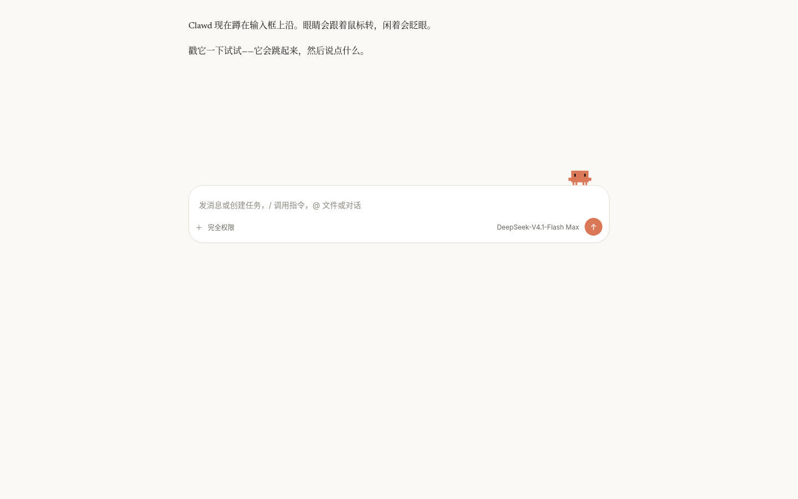

# dsh-claude-crab

给 DeepSeek Harness Web GUI 加一只**可以戳的 Clawd**——Claude Code 的像素小螃蟹。

它蹲在输入框上沿，眼睛跟着鼠标转，闲着会眨眼；戳一下会跳起来，说一句不太情愿的话。



---

## 它是什么

一只用**纯 CSS `box-shadow` 画的像素蟹**——没有图片、不发请求、不占资产体积。

- **眼睛跟随鼠标**：抬头 / 低头 / 左看 / 右看四个方向帧
- **空闲眨眼**：随机间隔，不会像节拍器一样规律
- **戳一下**：跳一下 + 欢呼表情 + 说一句话（10 句普通 + 3 句"困了"，18% 概率说困话）
- **键盘可达**：Tab 聚焦后按 Enter / 空格同样算戳
- **可点击但不可拖**：`pointer-events` 只开在自己身上，不挡输入框

它**不依赖任何皮肤**，单独装上就能用。

---

## 安装

```bash
dsh plugin --profile web add link:/绝对路径/dsh-claude-crab
```

装完**重启一次 DSH**（新增插件需要重启才会进入启动图谱），然后刷新页面。

卸载：

```bash
dsh plugin --profile web remove dsh-claude-crab
```

---

## 它挂在哪

插件直接挂到 composer 卡片的 `[data-composer-card]` 上——这是 conversation 包自己吐出的官方属性。

**为什么不用 Cordis slot**：早期版本把 React 组件注册进 `conversation.input.overlay`，但 slot 渲染抛错会被错误边界**静默吞掉**——插件确实加载了，蟹却没出现，且控制台看不到任何报错。改成直接挂 DOM 后，插件自己掌握元素生命周期，失败时还会 `console.warn` 明确报出来。

**代价**（说清楚）：这耦合了 composer 的 DOM 契约而非 slot 体系。如果 `[data-composer-card]` 将来变了，插件找不到落点，蟹就不出现——此时控制台会有一条 `[dsh-claude-crab]` 开头的警告，而不是静默失败。

---

## 配置

目前没有配置文件。想改的话直接改 `lib/client.js` 顶部的常量：

| 常量 | 作用 |
| --- | --- |
| `SIZE` | 蟹的缩放（默认 `0.85`） |
| `LINES` | 戳它时说的普通台词 |
| `SLEEPY` | "困了"时的台词（18% 概率） |
| `CSS` 里的 `right: 32px` | 距输入框右边缘的距离 |
| `CSS` 里的 `--dcc-body` / `--dcc-eye` | 蟹身与眼睛颜色 |

改完**重启 DSH** 生效。

---

## 已知限制

- **只在有输入框的会话视图里出现**。没有 composer 的界面（比如纯设置页）没有它。
- **不跟随主题色**。蟹身写死 `#d97757`（Claude 的珊瑚色），眼睛在深色模式下换成暖黑。想跟主题走的话把 `--dcc-body` 改成 `var(--dsw-alias-brand-primary)`。
- **不做平滑眼动**。像素画只有四个方向的离散帧，要平滑转动眼珠得重画精灵图。
- **反应期间暂停眨眼和眼动**（1.4 秒），否则你戳完它立刻眨眼，反应会被吃掉。

---

## 许可与声明

- **代码**：MIT，见 [`LICENSE`](LICENSE)。
- **Clawd 的像素几何**：Clawd 是 Anthropic 为 Claude Code 设计的吉祥物，**"Claude" 与 "Anthropic" 是 Anthropic PBC 的商标**，本项目是**非官方粉丝作品**，与 Anthropic 无任何隶属或背书关系。
  帧数据来自酒馆扩展 [claude-web](https://github.com/claudenoshujin/claude-web)（作者 **lulu**，**类脑社区**免费分发）——原像素美术的功劳归该作者。本项目只复用几何数据，选择器、动画、配色、摆放全部自写，未从该仓库复制任何文件。

---

## 致谢

- **lulu**（[claude-web](https://github.com/claudenoshujin/claude-web)）：Clawd 像素几何数据的来源。
- Anthropic：Clawd 这个角色本身。
